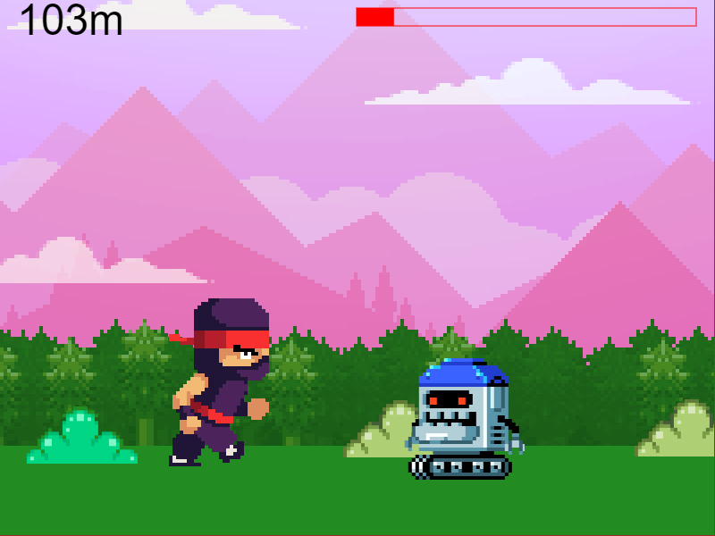

# Nanonaut game
## Table of contents

- [Overview](#overview)
  - [Screenshot](#screenshot)
  - [Links](#links)
- [My process](#my-process)
  - [Built with](#built-with)
  - [What I learned](#what-i-learned)
## Overview

It is a simple platform game that runs in a web browser. I made the game with the Polish book "Baw się kodem! Twoja własna gra. CoderDojo Nano".
### Screenshot

### Links

- Live Site URL: (https://karbowskam.github.io/nano-game/)

## My process

### Built with

- Gulp
- SASS
- Java Script

